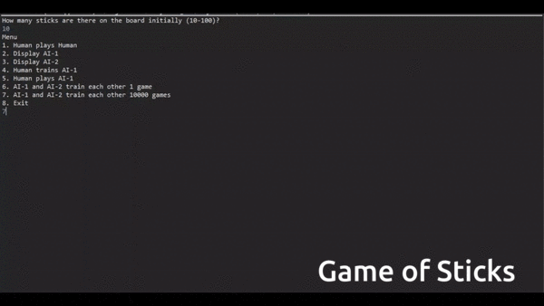

# Game Of Sticks
Game of Sticks is a game where a set amount of sticks is on the table. Players take turns to remove 1 to 3 sticks at a time until the last stick is picked up. The player that picks up the last stick loses. 

## Machine Implementation
While my teacher designed the framework for the game, the machine learning strategies in the AI class were implemented by me.
- At the start of each game, the AI initializes a 2D array that will store the information of which moves worked with a given number of sticks remaining.
- Every time the AI is asked for a move, it checks the maximum number of sticks that can be played with the amount of sticks currently present.
- Then, it adds up the probability values("balls") in each move's "hat". After a number is randomly selected in this range, the hat that contains that number is selected as the move. 
- When the AI is being trained, its moves are stored in a separate table. So if the AI wins the training game, the amount of balls in the hats that made it win are incremented and stored, increasing the probability that they will be picked next time. 
- If the AI loses the training game, the amount of balls in the hats that made it loses are decremented and stored, decreasing the probability that they will be picked next time. 

## Demo
To run the Game of Sticks using the `Game of Sticks.jar` file, cd command prompt to the directory where its stored. Then type `java -jar "Game of Sticks".jar` and start playing!
